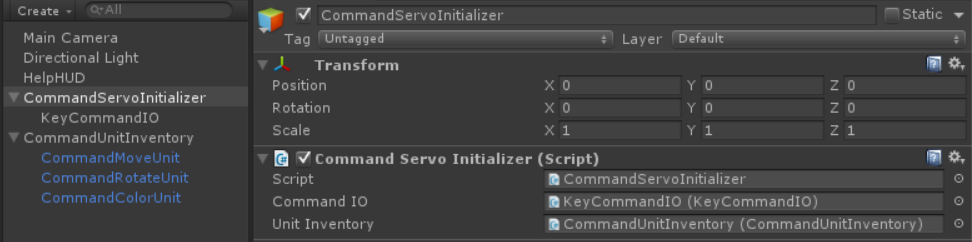

[TOC]

# MGS.CommandServo

## Summary
- Command servo system for Unity project.
- This project just provide the framework for command servo system.
- You can use it to do more things.

## Environment

- Unity 5.0 or above.
- .Net Framework 3.5 or above.

## Platform
- Windows

## Demand
- Listener the command IO and read command buffer.
- Parse the command buffer to Command.
- Execute the Command and respond the result after complete.
- Parse the respond result to buffer and write to command IO.

## Usage

- Implement interfaces base your business logic.

```C#
//Implement ICommandIO.
public class CommandIO : ICommandIO
{
    public byte[] ReadBuffer()
    {
        //TODO:
        return null;
    }

    public void WriteBuffer(byte[] buffer)
    {
        //TODO:
    }
}

//Implement ICommandParser.
public class CommandParser : ICommandParser
{
    public byte[] ToBuffer(Command Command)
    {
        //TODO:
        return null;
    }

    public IEnumerable<Command> ToCommands(byte[] buffer)
    {
        //TODO:
        return null;
    }
}

//Implement ICommandUnit.
public class MyCommandUnit : CommandUnit
{
    public override void Execute(params object[] args)
    {
        //TODO:
    }
}
```

- Construct command adapter.

```C#
var io = new CommandIO();
var parser = new CommandParser();
var adapter = new CommandAdapter(io, parser);
```

- Construct command unit register and Register units.

```c#
var register = new CommandUnitRegister();
var unit_0 = new MyCommandUnit();
register.RegisterUnit(unit_0);
```

- Initialize command processor.

```C#
//Processor base on Coroutine.
MonoCommandProcessor.Instance.Initialize(adapter, register);

//Processor base on Thread.
CommandProcessor.Instance.Initialize(adapter, register);
```


## Demo

- Demos in the path "MGS.Packages/CommandServo/Demo/" provide reference to you.

## Preview



------

Copyright © 2021 Mogoson.	mogoson@outlook.com
